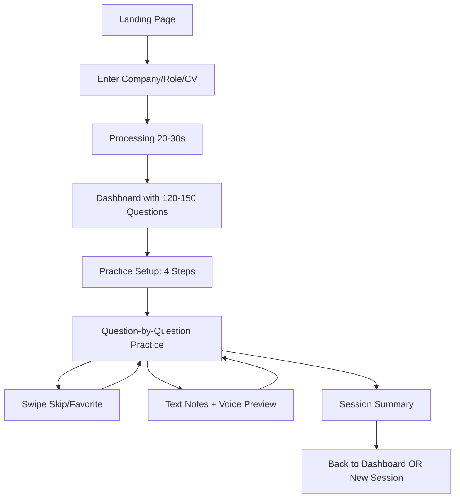
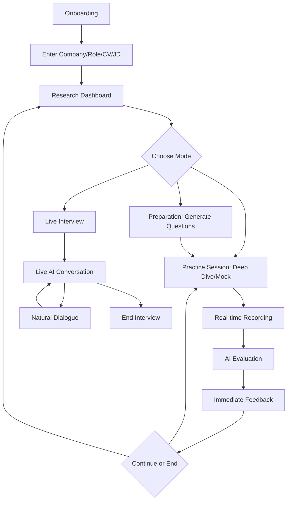

# UI/UX Redesign Analysis: Current vs. New Preprio Design

**Date**: December 9, 2025
**Analysis By**: Claude Code
**New Design Source**: https://github.com/Akkkkkkki/Hireo

---

## Executive Summary

This document analyzes the UI/UX differences between the current Preprio implementation (OpenAI/Supabase-based) and the new designer-produced version (Gemini-based). The two implementations represent fundamentally different approaches to interview preparation, with significant architectural, feature, and user experience divergences.

**Key Finding**: The new design represents a **major architectural shift** from a research-driven, static practice platform to a **real-time, conversational AI interview simulator** with live feedback and dynamic question generation.

---

## Table of Contents

1. [Core Architecture Differences](#1-core-architecture-differences)
2. [Feature Comparison Matrix](#2-feature-comparison-matrix)
3. [UI/UX Design Differences](#3-uiux-design-differences)
4. [User Flow Comparison](#4-user-flow-comparison)
5. [Technical Stack Differences](#5-technical-stack-differences)
6. [Implementation Effort Assessment](#6-implementation-effort-assessment)
7. [Migration Strategy Recommendations](#7-migration-strategy-recommendations)
8. [Risk Analysis](#8-risk-analysis)
9. [Conclusion & Recommendations](#9-conclusion--recommendations)

---

## 1. Core Architecture Differences

### 1.1 Current Implementation (OpenAI/Supabase)

**Philosophy**: Research-first, comprehensive preparation platform

**Architecture**:
- Microservices-based Edge Functions (4 services)
- PostgreSQL database with RLS
- Static question bank (120-150 questions per search)
- Asynchronous job processing with polling
- Text-based practice with optional voice recording preview
- Company research via Tavily API + DuckDuckGo fallback

**Data Flow**:
```
User Input → Company Research → Job Analysis → CV Analysis →
Question Generation (120-150) → Database Storage → Practice Session →
Manual Review & Note-taking
```

### 1.2 New Design (Gemini-based)

**Philosophy**: Real-time, conversational AI interview simulator

**Architecture**:
- Monolithic frontend with Gemini service layer
- Minimal/no database (state-based)
- Dynamic question generation on-demand
- Real-time bidirectional audio streaming
- Live AI interviewer with natural conversation
- Gap analysis with match scoring

**Data Flow**:
```
User Input → Deep Research (Gemini) → Gap Analysis →
Live Interview Session OR Practice Mode →
Real-time AI Evaluation → Holistic Feedback
```

---

## 2. Feature Comparison Matrix

| Feature Category | Current Implementation | New Design | Impact |
|-----------------|------------------------|------------|---------|
| **Company Research** | Multi-source web scraping (Tavily, DuckDuckGo), 15-25 actual questions from Glassdoor/Reddit | Single Gemini API call, semantic analysis | HIGH - Different data sources |
| **Question Generation** | 120-150 pre-generated questions (7 categories), research-driven | On-demand generation, user-specified quantity | HIGH - Fundamental approach change |
| **Practice Mode** | Static question bank, swipe gestures, text notes, voice preview | Two modes: Deep Dive (feedback-focused) & Mock Interview (realistic simulation) | CRITICAL - Complete UX shift |
| **Live Interview** | NOT AVAILABLE | Real-time bidirectional audio with AI interviewer | CRITICAL - New flagship feature |
| **CV Analysis** | Structured parsing with skill extraction, stored in database | Context for gap analysis and interview customization | MEDIUM - Different use of data |
| **Gap Analysis** | Implicit in CV-job comparison | Explicit match score (0-100%), visual gauge, strategic pivots | HIGH - New visualization |
| **User Onboarding** | Direct to search form, minimal guidance | Dedicated onboarding component with contextual help | MEDIUM - Better UX flow |
| **Progress Tracking** | Real-time polling with ProgressDialog, 13 distinct steps | Simpler loading states, less granular feedback | MEDIUM - Current more detailed |
| **Session Management** | Database-stored practice sessions with history | Session-based with no long-term storage | HIGH - Persistence model change |
| **Navigation** | Multi-page SPA with protected routes | Single-page with mode switching | HIGH - Different routing paradigm |
| **Audio Handling** | Client-side recording preview only | Full bidirectional WebRTC-style audio streaming | CRITICAL - Major technical requirement |
| **Feedback System** | Manual self-review with notes | AI-generated scores (clarity, relevance, structure), improved examples | HIGH - Automated vs. manual |
| **Holistic Evaluation** | None | Hiring decision verdict (Strong Hire/Hire/etc.), aggregated strengths/weaknesses | HIGH - New feature |
| **Question Filtering** | Multi-dimensional (category, difficulty, favorites) | Stage-based only | MEDIUM - Current more flexible |
| **User Authentication** | Supabase Auth (email/password) | Not visible in components (likely minimal) | MEDIUM - Current more robust |
| **Data Persistence** | PostgreSQL with full CRUD operations | Appears minimal/session-only | HIGH - Architecture change |

---

## 3. UI/UX Design Differences

### 3.1 Visual Design Language

#### Current Implementation
- **Color Scheme**: Fresh Green (#28A745) primary, clean white backgrounds
- **Component Library**: shadcn/ui (48+ components)
- **Design System**: Comprehensive with custom motion utilities
- **Typography**: Standard scale with clear hierarchy
- **Spacing**: Generous with 8px grid system
- **Animations**: Custom motion classes with cubic-bezier easing
- **Icons**: Lucide React (selective use)

#### New Design
- **Color Scheme**: Slate (neutral professional), Indigo accents, Emerald/Amber/Rose semantic
- **Component Library**: Custom components (no shadcn/ui detected)
- **Design System**: Card-based with shadow treatments
- **Typography**: Similar hierarchy with bolder headers
- **Spacing**: Similar spacing principles
- **Animations**: Simpler fade-in/zoom animations
- **Icons**: Lucide React (extensive use - 40+ icons)

**Design Divergence**: The new design uses a more **subdued, professional color palette** (slate/indigo) compared to the current **vibrant green branding**. The new design also has **more visual complexity** with SVG gauges, animated canvases, and richer iconography.

### 3.2 Layout Patterns

#### Current Implementation
- **Dashboard**: Stage-based list with checkboxes, question counts
- **Practice**: Full-screen single question with bottom navigation, dot indicators
- **Profile**: Side-by-side CV editor and parsed view
- **Navigation**: Persistent top nav with sticky positioning

#### New Design
- **Research**: Multi-column grid dashboard with circular gauge, card-based sections
- **Practice**: Full-screen modal overlays for recording/analysis states
- **Preparation**: List view with expandable rows for question details
- **Live Interview**: Studio environment with canvas visualizer, floating controls
- **Navigation**: Mode-based switching (less navigation, more state changes)

**Layout Divergence**: Current design favors **navigation-heavy multi-page flows**, while new design uses **state-based mode switching** within single components. New design has **richer data visualizations** (gauges, charts, timers).

### 3.3 Interaction Patterns

#### Current Implementation
- **Swipe Gestures**: Left=skip, Right=favorite
- **Keyboard Shortcuts**: Arrow keys, 'S' for skip
- **Auto-save**: 5-second debounce to sessionStorage
- **Multi-step Wizards**: 4-step practice setup
- **Real-time Polling**: Progress updates every 2 seconds
- **Drag-and-Drop**: None
- **Voice Input**: Preview only (not evaluated)

#### New Design
- **Click-based Navigation**: Button-driven progression
- **Live Audio Streaming**: Real-time recording and playback
- **Expandable Rows**: Click to reveal details
- **Mode Selection**: Deep Dive vs. Mock Interview
- **On-demand Generation**: Generate questions as needed
- **Real-time Feedback**: Immediate AI evaluation
- **Mute Toggle**: During live interviews

**Interaction Divergence**: Current design is **optimized for mobile with gestures**, while new design is **desktop-first with rich interactions**. New design introduces **conversational patterns** not present in current implementation.

### 3.4 Information Architecture

#### Current Implementation
```
Home (Search Entry)
├── Dashboard (Results Overview)
│   ├── Interview Stages (7 stages)
│   ├── Question Counts (120-150 total)
│   └── Practice Setup
├── Practice (Active Session)
│   ├── Question Frame (single Q)
│   ├── Insights Panel (guidance)
│   ├── Helper Drawer (notes/recording)
│   └── Navigation (dots, progress)
└── Profile (CV Management)
    ├── Experience Level
    ├── CV Editor
    └── Parsed Display
```

#### New Design
```
Onboarding (Initial Setup)
├── Research (Company Analysis)
│   ├── Match Score Gauge
│   ├── Gap Analysis
│   ├── Core Values
│   ├── Interview Process
│   └── Recent News
├── Preparation (Question Bank)
│   ├── Filter by Stage
│   ├── Generate Questions
│   └── Expandable Details
├── Practice Session
│   ├── Mode: Deep Dive
│   │   ├── Recording Interface
│   │   ├── Immediate Feedback
│   │   └── Improved Examples
│   └── Mode: Mock Interview
│       ├── Sequential Questions
│       ├── Holistic Evaluation
│       └── Hiring Decision
└── Live Interview
    ├── Real-time Audio
    ├── AI Interviewer
    ├── Canvas Visualizer
    └── Controls (Mute/End)
```

**IA Divergence**: Current implementation has **deeper navigation hierarchy** with persistent state, while new design has **flatter, mode-based structure**. New design **centralizes research** more prominently.

---

## 4. User Flow Comparison

### 4.1 Current Implementation User Journey



**Key Characteristics**:
- **Linear, guided flow** with clear progression
- **Heavy upfront processing** (20-30 seconds)
- **Self-directed practice** with manual review
- **Persistent data** across sessions
- **Multi-session support** with history

### 4.2 New Design User Journey



**Key Characteristics**:
- **Non-linear, exploratory flow** with mode switching
- **Fast initial load** with on-demand generation
- **AI-guided practice** with real-time feedback
- **Session-based** (minimal persistence)
- **Conversational paradigm** in live mode

**Flow Divergence**: Current design is **preparation-focused** (build question bank → practice), while new design is **simulation-focused** (research → immediate practice/interview).

---

## 5. Technical Stack Differences

### 5.1 Current Implementation

| Layer | Technology | Purpose |
|-------|-----------|---------|
| **Frontend** | React 18 + TypeScript | UI components |
| **Build Tool** | Vite | Development & bundling |
| **Styling** | Tailwind CSS + shadcn/ui | Design system |
| **State Management** | TanStack Query | Server state caching |
| **Routing** | React Router | Navigation |
| **Backend** | Supabase Edge Functions | Microservices (4 functions) |
| **Database** | PostgreSQL + RLS | Data persistence |
| **AI Provider** | OpenAI GPT-4o | Question generation, analysis |
| **Search APIs** | Tavily + DuckDuckGo | Company research |
| **Auth** | Supabase Auth | User authentication |
| **Audio** | Browser MediaRecorder API | Voice recording preview |

### 5.2 New Design

| Layer | Technology | Purpose |
|-------|-----------|---------|
| **Frontend** | React + TypeScript | UI components |
| **Build Tool** | Vite | Development & bundling |
| **Styling** | Tailwind CSS (custom) | Styling |
| **State Management** | React useState/useContext | Local state |
| **Routing** | Mode-based switching | Navigation (no router) |
| **Backend** | Minimal/none visible | Logic in frontend services |
| **Database** | None/minimal | Session-based storage |
| **AI Provider** | Google Gemini 2.5 Flash | All AI capabilities |
| **Search APIs** | Gemini-based research | No external search APIs |
| **Auth** | Not visible | Likely minimal |
| **Audio** | getUserMedia + AudioContext | Full bidirectional streaming |

### 5.3 Key Technical Gaps

| Capability | Current | New Design | Migration Challenge |
|-----------|---------|------------|---------------------|
| **Database** | Full PostgreSQL | None/minimal | HIGH - Need persistence strategy |
| **Authentication** | Robust Supabase Auth | Minimal | MEDIUM - Auth refactor required |
| **Microservices** | 4 Edge Functions | Monolithic frontend | HIGH - Architecture change |
| **Real-time Audio** | Preview only | Full duplex streaming | CRITICAL - Major development |
| **Question Bank** | Pre-generated 120-150 | On-demand | HIGH - Different generation model |
| **Search APIs** | Multi-source | Gemini-only | MEDIUM - Less diverse data |
| **Component Library** | shadcn/ui (48+) | Custom components | MEDIUM - Rebuild components |
| **Progress Tracking** | Real-time polling | Simple loading | LOW - Simplification |

---

## 6. Implementation Effort Assessment

### 6.1 Effort Estimation by Feature

| Feature | Effort Level | Estimated Hours | Priority | Dependencies |
|---------|-------------|-----------------|----------|--------------|
| **Live Interview Audio Streaming** | CRITICAL | 80-120 | HIGH | Gemini API integration, WebRTC knowledge |
| **Research Dashboard with Gauges** | HIGH | 40-60 | MEDIUM | SVG/Canvas expertise, Gemini API |
| **Gap Analysis & Match Scoring** | HIGH | 30-50 | MEDIUM | AI prompt engineering |
| **Practice Session Modes (Deep Dive/Mock)** | HIGH | 60-80 | HIGH | Audio recording, AI evaluation |
| **Real-time Feedback System** | HIGH | 50-70 | HIGH | Gemini API, scoring algorithms |
| **Onboarding Component** | MEDIUM | 20-30 | LOW | Standard form development |
| **Preparation with On-demand Generation** | HIGH | 40-60 | MEDIUM | Question generation refactor |
| **Holistic Evaluation System** | MEDIUM | 30-40 | MEDIUM | AI prompt design |
| **Component Redesign (visual style)** | MEDIUM | 60-80 | LOW | CSS/Tailwind work |
| **Migration from Supabase to Session-based** | HIGH | 40-60 | HIGH | Architecture decision |
| **Remove shadcn/ui, Build Custom Components** | MEDIUM | 50-70 | LOW | UI development |
| **Testing & QA** | HIGH | 80-100 | HIGH | All features |

**Total Estimated Hours**: **560-820 hours** (14-20 weeks for single developer)

### 6.2 Effort Breakdown by Phase

#### Phase 1: Foundation (120-180 hours)
- Set up Gemini API integration
- Build basic audio streaming infrastructure
- Create new component library (remove shadcn/ui)
- Implement onboarding flow

#### Phase 2: Core Features (200-280 hours)
- Develop research dashboard with gap analysis
- Build practice session modes (Deep Dive/Mock)
- Implement real-time feedback system
- Create preparation component with on-demand generation

#### Phase 3: Advanced Features (140-200 hours)
- Build live interview with bidirectional audio
- Implement holistic evaluation
- Add match scoring and visualizations
- Develop session management

#### Phase 4: Polish & Testing (100-160 hours)
- Visual design refinement
- Cross-browser/device testing
- Performance optimization
- User acceptance testing

### 6.3 Team Composition Requirements

**Recommended Team**:
- 1x Senior Full-Stack Engineer (React + Backend)
- 1x Audio/WebRTC Specialist (for live interview)
- 1x AI/ML Engineer (Gemini integration, prompt engineering)
- 1x UI/UX Designer (visual design implementation)
- 1x QA Engineer (testing, especially audio)

**Reduced Team**:
- 2x Senior Full-Stack Engineers with audio/AI experience
- Part-time QA support

---

## 7. Migration Strategy Recommendations

### 7.1 Strategy Options

#### Option A: Full Replacement (High Risk)
**Approach**: Build new design from scratch, deprecate current implementation

**Pros**:
- Clean architecture without legacy constraints
- Opportunity to fix current technical debt
- Simpler codebase maintenance

**Cons**:
- 14-20 weeks development time
- Loss of existing features (history, persistence)
- High risk of project failure
- Users lose current data

**Recommendation**: ⚠️ **NOT RECOMMENDED** - Too risky for production system

#### Option B: Hybrid Integration (Medium Risk)
**Approach**: Add new features to current implementation, preserve core architecture

**Phases**:
1. **Add Live Interview Mode** (Phase 1: 8-10 weeks)
   - Integrate Gemini API alongside OpenAI
   - Build live interview component in current app
   - Keep existing practice mode intact
   - Allow users to choose traditional vs. live mode

2. **Enhance Research Dashboard** (Phase 2: 4-6 weeks)
   - Add gap analysis visualization to current dashboard
   - Implement match scoring as new metric
   - Preserve existing question generation
   - Add visual gauge components

3. **Add Feedback System** (Phase 3: 6-8 weeks)
   - Implement real-time AI evaluation
   - Add scoring to existing practice sessions
   - Preserve text notes and manual review
   - Make evaluation optional

4. **Visual Redesign** (Phase 4: 4-6 weeks)
   - Update color scheme to slate/indigo
   - Enhance iconography
   - Preserve shadcn/ui foundation
   - Iterative visual updates

**Pros**:
- Incremental value delivery
- Preserve existing user data
- Lower risk of catastrophic failure
- Users can choose preferred mode

**Cons**:
- More complex codebase (two paradigms)
- Longer total timeline (22-30 weeks)
- Potential technical debt accumulation

**Recommendation**: ✅ **RECOMMENDED** - Balanced approach with manageable risk

#### Option C: Parallel Development (Low Risk)
**Approach**: Build new design as separate application, run both concurrently

**Phases**:
1. Build new design (14-20 weeks)
2. Beta testing with select users (4 weeks)
3. Gradual migration (8 weeks)
4. Deprecate old version (4 weeks)

**Pros**:
- Zero disruption to current users
- Full beta testing before migration
- Can abort if new design fails
- Clean architectural separation

**Cons**:
- Requires infrastructure duplication
- Longer total timeline (30-36 weeks)
- Higher maintenance burden during transition
- Potential user confusion with two versions

**Recommendation**: ✅ **VIABLE** - Safest but slowest approach

### 7.2 Recommended Strategy: Hybrid Integration

**Rationale**:
- Preserves current investment in architecture and features
- Adds high-value new features (live interview, gap analysis)
- Minimizes user disruption
- Allows A/B testing of new features
- Manageable technical complexity

**Implementation Plan**:

#### Stage 1: Live Interview Addition (10 weeks)
```
Week 1-2:   Gemini API integration, audio infrastructure
Week 3-5:   Live interview component development
Week 6-8:   Integration with current app, user flow design
Week 9-10:  Testing, bug fixes, documentation
```

**Deliverable**: New "Live Interview" mode accessible from Dashboard

#### Stage 2: Research Enhancement (6 weeks)
```
Week 1-2:   Gap analysis algorithm, match scoring
Week 3-4:   Visual components (gauges, charts)
Week 5-6:   Integration with current research flow, testing
```

**Deliverable**: Enhanced Dashboard with gap analysis and match scoring

#### Stage 3: Feedback System (8 weeks)
```
Week 1-3:   AI evaluation engine (Gemini-based scoring)
Week 4-6:   UI for feedback display, improved examples
Week 7-8:   Integration with practice sessions, testing
```

**Deliverable**: Optional AI feedback in practice sessions

#### Stage 4: Visual Refresh (6 weeks)
```
Week 1-2:   Color scheme update, icon additions
Week 3-4:   Component visual enhancements
Week 5-6:   Responsive design improvements, polish
```

**Deliverable**: Updated visual design while preserving functionality

**Total Timeline**: 30 weeks (7.5 months)

---

## 8. Risk Analysis

### 8.1 Technical Risks

| Risk | Severity | Probability | Mitigation Strategy |
|------|----------|-------------|---------------------|
| **Audio streaming complexity** | HIGH | HIGH | Hire WebRTC specialist, use proven libraries |
| **Gemini API limitations** | MEDIUM | MEDIUM | Maintain OpenAI as fallback, test thoroughly |
| **Cross-browser audio compatibility** | HIGH | MEDIUM | Extensive browser testing, graceful degradation |
| **Real-time latency issues** | MEDIUM | HIGH | Optimize audio pipeline, set user expectations |
| **Loss of existing features** | HIGH | LOW | Preserve current functionality in hybrid approach |
| **Database migration complexity** | HIGH | MEDIUM | Avoid full migration, add new tables instead |
| **Performance degradation** | MEDIUM | MEDIUM | Load testing, code splitting, lazy loading |
| **Security vulnerabilities** | HIGH | MEDIUM | Security audit, especially for audio handling |

### 8.2 Business Risks

| Risk | Severity | Probability | Impact | Mitigation |
|------|----------|-------------|---------|-----------|
| **User rejection of new design** | HIGH | MEDIUM | Lost users, negative feedback | A/B testing, gradual rollout, user surveys |
| **Extended development timeline** | MEDIUM | HIGH | Delayed ROI, opportunity cost | Phased delivery, MVP approach |
| **Budget overrun** | HIGH | MEDIUM | Financial strain | Fixed-price contracts, buffer budget |
| **Technical debt accumulation** | MEDIUM | HIGH | Long-term maintenance burden | Code reviews, refactoring sprints |
| **Competitive disadvantage during dev** | MEDIUM | MEDIUM | Market share loss | Focus on differentiating features first |
| **Loss of current user data** | HIGH | LOW | User churn, trust damage | Maintain database, migration tools |

### 8.3 Mitigation Priorities

**Critical Mitigations** (Must Do):
1. **Preserve existing functionality** - No feature removal
2. **Extensive audio testing** - Cross-browser, network conditions
3. **Security audit** - Especially audio streaming, API keys
4. **User acceptance testing** - Early feedback on live interview
5. **Gradual rollout** - Feature flags, A/B testing
6. **Performance monitoring** - Real-time latency tracking

**Important Mitigations** (Should Do):
1. Hire audio specialist for live interview
2. Build comprehensive test suite
3. Document architecture thoroughly
4. Create user migration guides
5. Monitor user analytics post-launch
6. Establish rollback procedures

**Nice-to-Have Mitigations**:
1. Beta program with power users
2. Customer advisory board for feedback
3. Performance optimization sprints
4. Accessibility audit

---

## 9. Conclusion & Recommendations

### 9.1 Key Findings Summary

1. **Architectural Paradigm Shift**: The new design represents a fundamental change from a research-driven, static preparation platform to a real-time, conversational AI simulator. This is not a simple UI refresh but a complete product reimagining.

2. **Feature Parity Challenge**: The new design lacks several current features (persistent history, comprehensive question bank, swipe gestures, multi-session support) while adding entirely new capabilities (live interview, gap analysis, real-time feedback).

3. **Technical Complexity**: Implementing live bidirectional audio streaming is a **major technical undertaking** requiring specialized expertise. This is the highest-risk component of the migration.

4. **Timeline Reality**: A full replacement would take **14-20 weeks minimum** for a single developer, or **10-14 weeks** for a small team. A hybrid approach extends to **22-30 weeks** but with lower risk.

5. **User Experience Trade-offs**: The new design is **more visually impressive** and **offers exciting new features** (live interview), but the current implementation has **more mature functionality** for traditional preparation (comprehensive question bank, detailed tracking, persistence).

### 9.2 Strategic Recommendations

#### Recommendation 1: Adopt Hybrid Integration Strategy ✅

**Why**: Balances innovation with risk management. Adds high-value features without disrupting current users.

**Key Actions**:
- Prioritize live interview feature as flagship addition
- Enhance research dashboard with gap analysis
- Add optional AI feedback to practice sessions
- Preserve all existing functionality

**Success Metrics**:
- 30% of users try live interview mode within 3 months
- 60% user satisfaction with new features
- Zero critical bugs in production
- <5% performance degradation

#### Recommendation 2: Focus on Differentiating Features 🎯

**Priority Order**:
1. **Live Interview** (Highest value, highest differentiation)
2. **Gap Analysis** (High value, medium effort)
3. **Real-time Feedback** (High value, high effort)
4. **Visual Refresh** (Medium value, low-medium effort)

**Deprioritize**:
- Complete UI overhaul (preserve shadcn/ui)
- Removal of existing features
- Database migration

#### Recommendation 3: Invest in Audio Infrastructure 🔊

**Why**: Live interview is the most technically challenging and most differentiating feature.

**Key Actions**:
- Hire WebRTC/audio specialist (contract or full-time)
- Build robust audio infrastructure with fallbacks
- Extensive cross-browser testing (Chrome, Firefox, Safari, Edge)
- Test on various network conditions (simulate latency, packet loss)
- Create graceful degradation paths (fallback to text if audio fails)

**Budget Allocation**: 30-40% of total development effort

#### Recommendation 4: Maintain Current Architecture 🏗️

**Why**: Current Supabase/PostgreSQL stack is proven and robust. Migrating to session-only storage loses valuable features.

**Key Actions**:
- Keep Supabase Edge Functions for backend
- Preserve PostgreSQL database with RLS
- Add Gemini API alongside OpenAI (not replacing)
- Store live interview recordings and transcripts
- Maintain user authentication and profiles

**Trade-off**: Slightly more complex architecture, but preserves data integrity and user history

#### Recommendation 5: Phased Rollout with Feature Flags 🚩

**Why**: Reduces risk, allows A/B testing, enables quick rollback.

**Implementation**:
- Use feature flags for all new features (LaunchDarkly, PostHog, or custom)
- Roll out to 5% → 25% → 50% → 100% of users
- Monitor metrics at each stage (usage, errors, satisfaction)
- Collect user feedback via in-app surveys
- Be prepared to disable features if issues arise

**Timeline**: 2-4 weeks per rollout stage

### 9.3 Alternative Scenario: Full Replacement

**If you decide to pursue full replacement despite risks**:

**Prerequisites**:
- Secure 20-30 weeks of dedicated development time
- Hire or contract specialized audio engineer
- Establish comprehensive testing infrastructure
- Create data migration tools for existing users
- Build user communication plan for transition

**Critical Success Factors**:
1. User data migration path (export/import at minimum)
2. Feature parity for core workflows
3. Extensive beta testing (minimum 100 users, 4 weeks)
4. Rollback plan if launch fails
5. Customer support prepared for transition issues

**Budget**: Expect **$80,000-$150,000** for contracted development, or **$50,000-$80,000** for in-house team (at standard US rates).

### 9.4 Final Verdict

**Recommended Path Forward**:

✅ **Adopt Hybrid Integration Strategy**
✅ **Prioritize Live Interview Feature**
✅ **Enhance Research with Gap Analysis**
✅ **Add Optional AI Feedback**
✅ **Gradual Visual Refresh**
⚠️ **Preserve Current Architecture**
❌ **Avoid Full Replacement**
❌ **Don't Remove Existing Features**

**Expected Outcome**:
- Successful integration of new design's best features
- Preserved current functionality and user data
- Differentiated offering with live interview capability
- Manageable risk and timeline (30 weeks)
- Improved user experience without disruption

**Next Steps**:
1. Review this analysis with stakeholders
2. Make go/no-go decision on hybrid approach
3. If approved, begin Phase 1 (Live Interview) planning
4. Hire audio specialist or contract firm
5. Set up project infrastructure (feature flags, monitoring)
6. Begin Gemini API integration and testing

---

## Appendix A: Detailed Feature Comparison

### Research & Analysis

| Feature | Current | New | Notes |
|---------|---------|-----|-------|
| Company information gathering | ✅ Multi-source (Tavily, DuckDuckGo) | ✅ Gemini-based | Current has more diverse sources |
| Job description analysis | ✅ Dedicated microservice | ✅ Included in research | Similar capability |
| CV parsing | ✅ Structured extraction | ✅ Context analysis | Current more detailed |
| Interview process mapping | ✅ 7-stage structure | ✅ Stage extraction | Similar |
| Gap analysis | ⚠️ Implicit | ✅ Explicit with scoring | New design superior |
| Match scoring | ❌ None | ✅ 0-100% with gauge | New feature |
| Strategic pivots | ❌ None | ✅ Included | New feature |
| Core values extraction | ⚠️ Part of company data | ✅ Dedicated section | New design clearer |
| Recent news | ✅ Included | ✅ Included | Similar |
| Actual interview questions | ✅ 15-25 from web | ⚠️ Unknown | Current advantage |

### Question Generation

| Feature | Current | New | Notes |
|---------|---------|-----|-------|
| Question quantity | ✅ 120-150 pre-generated | ⚠️ On-demand, variable | Current more comprehensive |
| Question categories | ✅ 7 categories | ⚠️ Stage-based only | Current more diverse |
| Experience-level adaptation | ✅ Junior/Mid/Senior | ⚠️ Less visible | Current more sophisticated |
| Research-driven questions | ✅ 60%+ company-specific | ⚠️ Unknown | Current strength |
| Question quality scoring | ✅ 0-1 confidence score | ❌ None visible | Current advantage |
| Question metadata | ✅ Comprehensive | ⚠️ Limited | Current more detailed |
| Generation timing | ✅ Upfront (20-30s) | ✅ On-demand (faster initial) | Trade-off |

### Practice & Learning

| Feature | Current | New | Notes |
|---------|---------|-----|-------|
| Practice modes | ⚠️ Single mode | ✅ Two modes (Deep Dive, Mock) | New design more flexible |
| Live interview | ❌ None | ✅ Real-time AI conversation | Major new feature |
| Question navigation | ✅ Swipe gestures | ⚠️ Button-based | Current better for mobile |
| Keyboard shortcuts | ✅ Yes | ❌ None visible | Current advantage |
| Voice recording | ⚠️ Preview only | ✅ Full evaluation | New design superior |
| Text notes | ✅ Auto-save | ✅ Included | Similar |
| Real-time feedback | ❌ Manual only | ✅ AI-generated | Major new feature |
| Improved examples | ❌ None | ✅ Included | New feature |
| Holistic evaluation | ❌ None | ✅ Hiring decision verdict | New feature |
| Session history | ✅ Persistent | ⚠️ Session-only | Current advantage |
| Progress tracking | ✅ Detailed | ⚠️ Basic | Current more comprehensive |
| Question insights | ✅ Comprehensive panel | ⚠️ Limited | Current more helpful |

### Data & Persistence

| Feature | Current | New | Notes |
|---------|---------|-----|-------|
| User authentication | ✅ Supabase Auth | ⚠️ Minimal/none | Current more robust |
| Database | ✅ PostgreSQL + RLS | ❌ None/minimal | Current has persistence |
| Search history | ✅ Full history | ❌ None visible | Current advantage |
| Practice session history | ✅ Stored | ❌ Session-only | Current advantage |
| Resume storage | ✅ Profile storage | ⚠️ Unknown | Current clear |
| Question favorites | ✅ Persistent | ⚠️ Session-only | Current advantage |
| User preferences | ✅ Stored | ⚠️ Unknown | Current advantage |

### UI/UX

| Feature | Current | New | Notes |
|---------|---------|-----|-------|
| Visual design | ⚠️ Green branding | ✅ Slate/indigo professional | New more sophisticated |
| Component library | ✅ shadcn/ui (48+ components) | ⚠️ Custom | Current more consistent |
| Animations | ✅ Custom motion system | ⚠️ Basic | Current more polished |
| Responsive design | ✅ Mobile-first | ⚠️ Desktop-first | Current better for mobile |
| Accessibility | ✅ Good | ⚠️ Unknown | Current likely better |
| Data visualizations | ⚠️ Basic | ✅ Rich (gauges, charts) | New more visual |
| Iconography | ⚠️ Selective | ✅ Extensive | New more visual |
| Loading states | ✅ Detailed | ⚠️ Basic | Current better feedback |

---

## Appendix B: Technical Architecture Diagrams

### Current Architecture
```
┌─────────────────────────────────────────────────────────────┐
│                        Frontend (React)                      │
│  ┌──────────┐  ┌──────────┐  ┌──────────┐  ┌──────────┐   │
│  │   Home   │  │Dashboard │  │ Practice │  │ Profile  │   │
│  └──────────┘  └──────────┘  └──────────┘  └──────────┘   │
│                                                               │
│  ┌─────────────────────────────────────────────────────┐   │
│  │          TanStack Query (Server State Cache)        │   │
│  └─────────────────────────────────────────────────────┘   │
└─────────────────────────────────────────────────────────────┘
                            │
                            ▼
┌─────────────────────────────────────────────────────────────┐
│                   Supabase Backend                           │
│  ┌─────────────────────────────────────────────────────┐   │
│  │              Edge Functions (Microservices)          │   │
│  │  ┌─────────────┐  ┌──────────────┐  ┌───────────┐  │   │
│  │  │  Company    │  │  Interview   │  │    Job    │  │   │
│  │  │  Research   │  │  Research    │  │  Analysis │  │   │
│  │  └─────────────┘  └──────────────┘  └───────────┘  │   │
│  │  ┌─────────────┐  ┌──────────────┐                 │   │
│  │  │     CV      │  │   Question   │                 │   │
│  │  │  Analysis   │  │  Generator   │                 │   │
│  │  └─────────────┘  └──────────────┘                 │   │
│  └─────────────────────────────────────────────────────┘   │
│                                                               │
│  ┌─────────────────────────────────────────────────────┐   │
│  │        PostgreSQL Database (with RLS)               │   │
│  │  searches | search_artifacts | interview_stages    │   │
│  │  interview_questions | practice_sessions | ...     │   │
│  └─────────────────────────────────────────────────────┘   │
└─────────────────────────────────────────────────────────────┘
                            │
                            ▼
┌─────────────────────────────────────────────────────────────┐
│                    External Services                         │
│  ┌──────────┐  ┌──────────┐  ┌──────────┐                  │
│  │  OpenAI  │  │  Tavily  │  │DuckDuckGo│                  │
│  │  GPT-4o  │  │   API    │  │  Search  │                  │
│  └──────────┘  └──────────┘  └──────────┘                  │
└─────────────────────────────────────────────────────────────┘
```

### New Design Architecture
```
┌─────────────────────────────────────────────────────────────┐
│                     Frontend (React)                         │
│  ┌───────────┐  ┌──────────┐  ┌──────────┐  ┌──────────┐  │
│  │Onboarding │  │ Research │  │Preparation│  │ Practice │  │
│  └───────────┘  └──────────┘  └──────────┘  └──────────┘  │
│  ┌──────────────────────────────────────┐                   │
│  │         Live Interview               │                   │
│  │  (Real-time Audio Streaming)         │                   │
│  └──────────────────────────────────────┘                   │
│                                                               │
│  ┌─────────────────────────────────────────────────────┐   │
│  │          Services Layer (Frontend)                   │   │
│  │  - performDeepResearch()                             │   │
│  │  - generateQuestions()                               │   │
│  │  - evaluateAnswer()                                  │   │
│  │  - generateHolisticFeedback()                        │   │
│  └─────────────────────────────────────────────────────┘   │
│                                                               │
│  ┌─────────────────────────────────────────────────────┐   │
│  │      State Management (useState/useContext)          │   │
│  └─────────────────────────────────────────────────────┘   │
└─────────────────────────────────────────────────────────────┘
                            │
                            ▼
┌─────────────────────────────────────────────────────────────┐
│                    Google Gemini API                         │
│  ┌─────────────────────────────────────────────────────┐   │
│  │  Gemini 2.5 Flash (Native Audio Preview)            │   │
│  │  - Text generation                                   │   │
│  │  - Audio streaming (bidirectional)                   │   │
│  │  - Real-time conversation                            │   │
│  │  - Semantic analysis                                 │   │
│  └─────────────────────────────────────────────────────┘   │
└─────────────────────────────────────────────────────────────┘
                            │
                            ▼
┌─────────────────────────────────────────────────────────────┐
│               Browser APIs (Client-side)                     │
│  ┌──────────────┐  ┌──────────────┐  ┌──────────────┐     │
│  │ getUserMedia │  │ AudioContext │  │sessionStorage│     │
│  │              │  │              │  │              │     │
│  └──────────────┘  └──────────────┘  └──────────────┘     │
└─────────────────────────────────────────────────────────────┘
```

### Key Architectural Differences
1. **Backend**: Supabase microservices → Frontend-only with Gemini
2. **Database**: PostgreSQL → Session storage
3. **AI**: OpenAI GPT-4o → Google Gemini 2.5
4. **Research**: Multi-API (Tavily, DuckDuckGo) → Gemini-based
5. **Audio**: MediaRecorder preview → Full duplex streaming

---

**Document Version**: 1.0
**Last Updated**: December 9, 2025
**Author**: Claude Code
**Status**: Final
